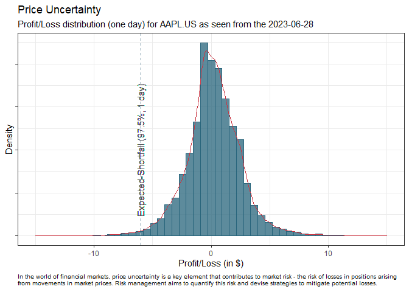

<!-- README.md is generated from README.Rmd. Please edit that file -->

# EnvisionRiskRaaS

<!-- badges: start -->
<!-- badges: end -->

Delve into the world of EnvisionRisk’s R package, your portal to our
sophisticated Market Risk-as-a-Service (RaaS). This comprehensive tool
allows you to tap into our cutting-edge risk management services,
retrieve relevant data, perform complex calculations, and generate
actionable insights, all without leaving your R programming environment.
Embrace this smarter, efficient approach to handling market risk.

Are you navigating the volatile waters of financial uncertainties,
seeking to make strategic decisions? Allow EnvisionRisk’s Cloud Service
to be your compass, providing a precise mechanism for quantifying market
risks. Replace guesswork with certainty; our platform furnishes you with
standardized metrics designed to enhance cost-efficiency and fortify
your financial bulwark.

Our REST API, a seamless blend of security and user-friendliness, stands
as your reliable tool for everyday risk quantification. Transform data
into actionable steps and unravel the potential concealed within the
labyrinth of financial complexities.

With an expansive coverage spanning more than 13,000 exchange-traded and
over-the-counter instruments—and continuously growing—EnvisionRisk is
primed to adapt to your ever-evolving needs.

Join the EnvisionRisk community today. Convert your market insights into
solid foresights, and consistently maintain a competitive edge in the
ever-fluctuating financial market. Stay not just in the game, but ahead
of it.

## Installation

You can install the development version of EnvisionRiskRaaS like so:

``` r
# Install EnvisionRiskRaaS from Github
devtools::install_github("EnvisionRisk/EnvisionRiskRaaS")
```

## Example

To use the service you need to be a registered user. If you don’t
already have credentials, you can sign up for a free trial account
[here](https://envisionrisk.shinyapps.io/user_management).

Although the following example may appear simple, it’s designed to
illustrate how our service functions by requesting the simulated
profit/loss (P/L) distribution for a single instrument — Apple (AAPL.US)
as of 2023-06-06. Remember, this is just a starting point; our service
also allows you to request simulated P/L distribution for your custom
portfolios. Through this, you gain invaluable insights into potential
future outcomes, enabling you to make informed investment decisions.

The Profit and Loss (P/L) distribution is a crucial component in the
world of market risk management as it provides a quantitative way of
understanding potential financial outcomes. Here’s why it plays an
essential role:

-   **Risk Assessment:** The P/L distribution represents the range of
    possible gains and losses that a portfolio might experience. It
    allows risk managers to visualize and quantify potential risks. For
    example, the tails of the distribution give insight into extreme
    events and potential for significant losses, enabling a
    comprehensive risk assessment.

-   **Risk Measures Calculation:** Key risk measures, like Value at Risk
    (VaR) and Expected Shortfall (ES), are derived from the P/L
    distribution. VaR estimates the potential loss a portfolio could
    face over a given period with a certain level of confidence, while
    ES provides the expected loss given that a loss exceeds the VaR
    threshold. These metrics help risk managers understand the risk
    landscape better and make informed decisions.

-   **Portfolio Optimization:** By understanding the P/L distribution,
    managers can optimize the portfolio for desired outcomes. It allows
    them to adjust the portfolio composition to control the risk,
    striking a balance between risk and return.

-   **Regulatory Compliance:** Regulators often require financial
    institutions to maintain capital reserves based on potential losses,
    which are derived from P/L distributions. Hence, understanding the
    P/L distribution is crucial to meet these regulatory requirements.

-   **Stress Testing:** Stress testing involves applying extreme but
    plausible hypothetical scenarios to the P/L distribution to assess
    the portfolio’s resilience. This helps managers prepare for
    unexpected market events and ensure that the portfolio can withstand
    adverse conditions.

Therefore, P/L distribution serves as a key pillar of market risk
management, providing insights into potential risks, informing
decision-making, enabling portfolio optimization, and ensuring
regulatory compliance.

``` r
library(ggplot2)
library(EnvisionRiskRaaS)

#Request the delta vector (for Apple) from the risk server
use_date   <- Sys.Date()
use_symbol <- "AAPL.US"

# The term '_raw' within the function name is indicative of a key feature: 
# the simulated price changes are denominated in the same currency as 
# the stock. This implies that the analysis maintains the original currency 
# perspective of the stock, allowing for more accurate and relevant 
# insights. It enhances ease of comprehension and direct applicability, 
# bringing us closer to the context of the actual trading environment.
api_response <- EnvisionRiskRaaS::envrsk_instrument_delta_vector_raw(
  date   = use_date, 
  symbol = use_symbol)

# Leverage the EnvisionRiskRaaS::envrsk_instrument_delta_vector function with 
# base_cur set to "DKK" to incorporate the risk associated with  USD/DKK 
# currency exchange fluctuations. This allows you to evaluate and strategize 
# around the additional layer of market risk presented by currency movements, 
# thereby providing a more comprehensive understanding of the potential impacts 
# on your investments.
# api_response <- EnvisionRiskRaaS::envrsk_instrument_delta_vector(
#   date     = use_date, 
#   symbol   = use_symbol,
#   base_cur = "DKK")

# Plot the P/L distribution (code hidden)

# Logout from the risk server
EnvisionRiskRaaS::envrsk_auth_log_out()
```



## API documentation

You can locate our extensive API documentation
[here](https://envisionrisk.stoplight.io/docs/api-aleadomus-documentation/9ed9f79a31a4a-market-risk-as-a-service-api).
This comprehensive guide is designed to walk you through our APIs’
functionalities, providing clear instructions on how to integrate and
use them effectively.

For each API, you’ll find detailed descriptions, parameter information,
example requests, and response formats to help you understand the API’s
purpose and functionality. Whether you’re interested in user
authentication, data retrieval, or performing specific actions, our
documentation has you covered.

In addition, you’ll find a section dedicated to ‘Common Use Cases’ where
we illustrate how our APIs can be combined and utilized in various
scenarios. This can be an invaluable resource for those seeking to
maximize the potential of our services.

Please note that our API documentation is constantly updated with new
features and improvements to ensure you have the latest information at
your fingertips.

Explore our API documentation today to get started with your
integrations and to make the most out of our services!
